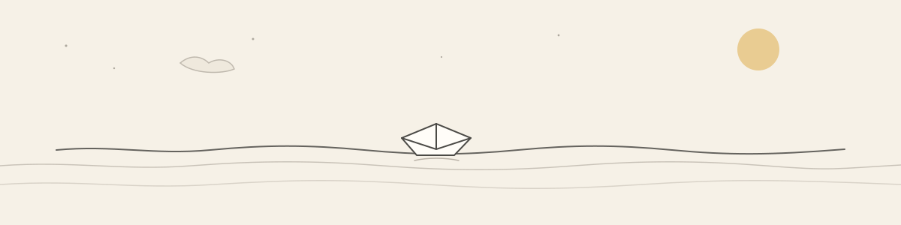
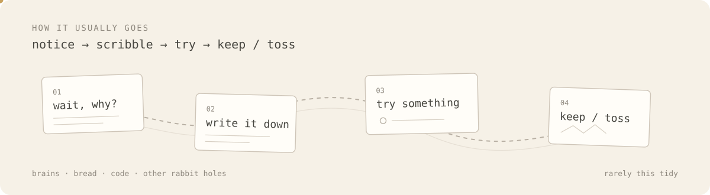

<picture>
  <source media="(prefers-color-scheme: dark)" srcset="./assets/tide-dark.svg">
  <source media="(prefers-color-scheme: light)" srcset="./assets/tide-light.svg">
  
</picture>

science · design · systems · experiments

Most things here start small: a question, a sketch, a rough model, or something worth testing.

I like the point where an idea becomes concrete enough to inspect, break, measure, and improve.

 

<picture>
  <source media="(prefers-color-scheme: dark)" srcset="./assets/route-dark.svg">
  <source media="(prefers-color-scheme: light)" srcset="./assets/route-light.svg">
  
</picture>

 

<table>
  <tr>
    <td width="33%" valign="top">
      <strong>observe</strong> 
      read carefully, measure what matters, notice what does not fit.
    </td>
    <td width="33%" valign="top">
      <strong>make</strong> 
      turn the idea into something that can actually be inspected.
    </td>
    <td width="33%" valign="top">
      <strong>test</strong> 
      keep what survives contact with reality; change what does not.
    </td>
  </tr>
</table>

  some become research. some become tools. some just become better questions.

<!-- if you opened the source, you are probably my kind of person. -->
