<p align="right">
  <strong>EN</strong> · <a href="./README.pt-BR.md">PT-BR</a>
</p>

<p align="center">
  
</p>

<p align="center">
  <strong>Founder · Product Builder · Systems Thinker</strong><br/>
  I build software and operating systems for real-world businesses.
</p>

---

### `// 01 — CURRENTLY BUILDING`

## BRIX

A connected operating layer for the food industry, starting with baking.

I’m building BRIX around **products, digital tools, technical knowledge, data and education** — not as isolated features, but as parts of one system designed to make operations more predictable, measurable and scalable.

```text
real-world problem → model → build → operate → measure → improve → scale
```

### `// 02 — HOW I BUILD`

| Layer | What I optimize for |
| :--- | :--- |
| **Product** | Useful before impressive. Clear UX around rigorous systems. |
| **Software** | Web systems, automation, internal tools and data products. |
| **Operations** | Repeatability, visibility and fewer manual handoffs. |
| **Business** | Distribution, unit economics and advantages that compound. |

### `// 03 — TOOLBOX`

`WordPress` · `PHP` · `JavaScript` · `HTML/CSS` · `Git/GitHub` · `Automation` · `Data` · `Product Systems`

### `// 04 — PRINCIPLES`

```text
useful > impressive
reliable > clever
measured > assumed
scale after proof
```

<details>
<summary><strong>More about how I think</strong></summary>
<br/>

I’m most interested in the moment when code stops being a demo and starts becoming infrastructure.

Good systems reduce uncertainty. They make decisions easier, expose what matters, survive growth and turn one-off work into repeatable capability.

That is the standard I try to build toward.

</details>

---

<p align="center">
  <code>software is leverage · operations are the test</code>
</p>
