<p align="right">
  <a href="./README.md">EN</a> · <strong>PT-BR</strong>
</p>

<p align="center">
  
</p>

<p align="center">
  <strong>Fundador · Product Builder · Systems Thinker</strong><br/>
  Construo software e sistemas operacionais para negócios do mundo real.
</p>

---

### `// 01 — CONSTRUINDO AGORA`

## BRIX

Uma camada operacional conectada para o setor alimentício, começando pela panificação.

Estou construindo a BRIX ao redor de **produtos, ferramentas digitais, conhecimento técnico, dados e educação** — não como recursos isolados, mas como partes de um mesmo sistema criado para tornar operações mais previsíveis, mensuráveis e escaláveis.

```text
problema real → modelo → construir → operar → medir → melhorar → escalar
```

### `// 02 — COMO EU CONSTRUO`

| Camada | O que eu otimizo |
| :--- | :--- |
| **Produto** | Utilidade antes de aparência. UX clara sobre sistemas rigorosos. |
| **Software** | Sistemas web, automação, ferramentas internas e produtos de dados. |
| **Operações** | Repetibilidade, visibilidade e menos transferências manuais. |
| **Negócio** | Distribuição, economia unitária e vantagens que se acumulam. |

### `// 03 — FERRAMENTAS & INTERESSES`

`WordPress` · `PHP` · `JavaScript` · `HTML/CSS` · `Git/GitHub` · `Automação` · `Dados` · `Sistemas de Produto`

### `// 04 — PRINCÍPIOS`

```text
útil > impressionante
confiável > esperto
medido > presumido
escala depois de prova
```

<details>
<summary><strong>Mais sobre como eu penso</strong></summary>
<br/>

O que mais me interessa é o momento em que código deixa de ser uma demonstração e passa a ser infraestrutura.

Bons sistemas reduzem incerteza. Eles facilitam decisões, deixam claro o que importa, sobrevivem ao crescimento e transformam trabalho pontual em capacidade repetível.

É esse o padrão que tento construir.

</details>

---

<p align="center">
  <code>software é alavancagem · operações são o teste</code>
</p>
